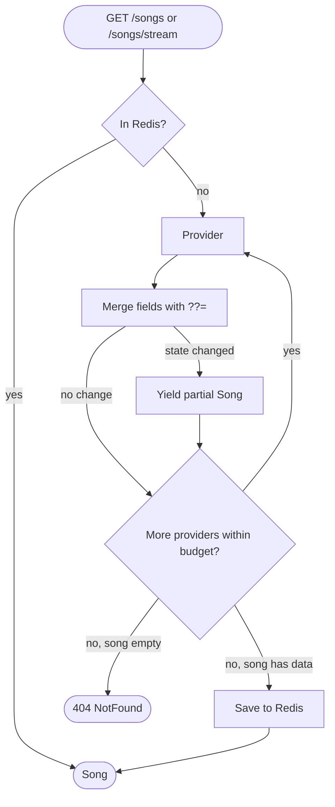
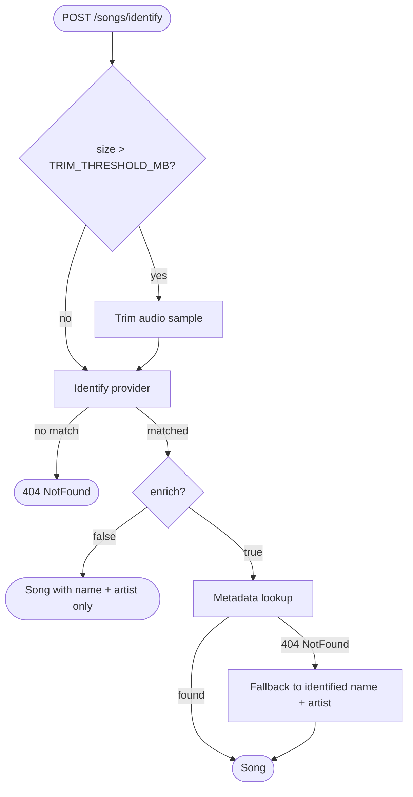

# Music MetaData API


REST API built with NestJS that aggregates and normalizes song metadata from multiple providers. Given a song name and artist, it queries several sources in priority order and returns a unified payload with name, artist, album, artwork and lyrics. It can also identify a song from an audio file.

---

## 1. Quick API reference

**Base URL**: `https://musicapi.jonathanalarcon.qzz.io`

**Swagger UI (interactive docs)**: `https://musicapi.jonathanalarcon.qzz.io/docs`

### `GET /songs`

Fetches normalized metadata for a known song.

| Parameter | Type   | Required | Description |
|-----------|--------|----------|-------------|
| `name`    | string | yes      | Song title  |
| `artist`  | string | yes      | Artist name |

```bash
curl "https://musicapi.jonathanalarcon.qzz.io/songs?name=Sweater+Weather&artist=The+Neighbourhood"
```

```json
{
  "name": "Sweater Weather",
  "artist": "The Neighbourhood",
  "album": "I Love You.",
  "artwork": ["https://cdn-images.dzcdn.net/.../1000x1000.jpg"],
  "lyrics": "And all I am is a man..."
}
```

### `GET /songs/stream`

Server-Sent Events (SSE) version of `GET /songs`. Streams a partial `Song` object every time a provider contributes new data, instead of waiting for every provider to finish. Each event carries the merged state so far; the client can render progressively (e.g. show the artwork as soon as it arrives, then the lyrics once available).

| Parameter | Type   | Required | Description |
|-----------|--------|----------|-------------|
| `name`    | string | yes      | Song title  |
| `artist`  | string | yes      | Artist name |

```bash
curl -N "https://musicapi.jonathanalarcon.qzz.io/songs/stream?name=Blinding+Lights&artist=The+Weeknd"
```

```
id: 1
data: {"name":"Blinding Lights","artist":"The Weeknd","album":"Blinding Lights - Single","artwork":["https://.../artwork1.jpg"],"lyrics":null}

id: 2
data: {"name":"Blinding Lights","artist":"The Weeknd","album":"Blinding Lights - Single","artwork":["https://.../artwork1.jpg","https://.../artwork2.jpg"],"lyrics":null}

id: 3
data: {"name":"Blinding Lights","artist":"The Weeknd","album":"Blinding Lights - Single","artwork":["https://.../artwork1.jpg","https://.../artwork2.jpg"],"lyrics":"..."}
```

Events are only emitted when the merged state actually changes — if a provider responds with nothing new, no event is sent. The stream closes once every provider has been queried; if the song was found in **Redis**, a single event with the full cached result is sent immediately and the stream closes right away.

### `POST /songs/identify`

Identifies a song from an audio file and returns its metadata.

Body — `multipart/form-data`:

| Field  | Type | Required | Description                    |
|--------|------|----------|--------------------------------|
| `file` | file | yes      | Audio file (≤20 MB, `audio/*`) |

Query parameters:

| Parameter | Type    | Required | Default | Description                                                                  |
|-----------|---------|----------|---------|------------------------------------------------------------------------------|
| `enrich`  | boolean | no       | `true`  | When `false`, skips metadata enrichment and returns only the identified song |

```bash
curl -X POST https://musicapi.jonathanalarcon.qzz.io/songs/identify -F "file=@song.mp3"
```

Response: same shape as `GET /songs`. If no provider recognizes the audio, the endpoint responds `404 Not Found`.

#### `enrich=false`: fast identification + progressive enrichment

By default the endpoint identifies the audio **and** waits for every metadata provider before responding. With `enrich=false` it returns as soon as identification succeeds — only `name` and `artist` are populated:

```bash
curl -X POST "https://musicapi.jonathanalarcon.qzz.io/songs/identify?enrich=false" -F "file=@song.mp3"
```

```json
{
  "name": "Blinding Lights",
  "artist": "The Weeknd",
  "album": null,
  "artwork": [],
  "lyrics": null
}
```

**What it's for.** It lets a client compose identification with `GET /songs/stream` to get a progressive UX. A single streaming identify endpoint is not viable with standard tooling: the browser's `EventSource` API only issues GET requests, while the audio sample requires a POST body. Splitting the flow into two standard calls sidesteps that conflict:

```js
// 1. Identify: fast POST, resolves as soon as a provider matches
const res = await fetch('/songs/identify?enrich=false', {
  method: 'POST',
  body: formData, // the audio file
});
const { name, artist } = await res.json();
renderBasicInfo(name, artist); // first paint, no waiting for metadata

// 2. Enrich: native EventSource against the SSE endpoint
const es = new EventSource(
  `/songs/stream?name=${encodeURIComponent(name)}&artist=${encodeURIComponent(artist)}`,
);
es.onmessage = (e) => renderSong(JSON.parse(e.data)); // album, artwork, lyrics as they arrive
es.addEventListener('error', () => es.close());
```

The result is the same progressive experience a streaming identify endpoint would give (one extra HTTP round-trip aside), while keeping native `EventSource` on the client and reusing the stream endpoint — and its Redis cache — on the server.

### `GET /health`

Liveness probe for orchestrators and uptime monitors. Exempt from rate limiting.

```json
{ "status": "ok", "uptime": 1234 }
```

---

## 2. Running it locally

### Requirements

- Node.js 20+
- `fpcalc` (Chromaprint) available on the system, required by AcoustID
- `ffmpeg` available on the system (optional — falls back to the bundled `ffmpeg-static`; see table below)
- **Redis** (optional) — used for metadata caching. If unavailable, the API falls back to in-memory caching (data is lost on restart).

### Installation

```bash
npm install
```

### FFmpeg

The `/songs/identify` endpoint trims the uploaded audio with `ffmpeg`. The native binary is the recommended option for best performance and compatibility. Install it per your system:

| System               | Command                   |
|----------------------|---------------------------|
| Debian / Ubuntu      | `sudo apt install ffmpeg` |
| Fedora               | `sudo dnf install ffmpeg` |
| Arch Linux           | `sudo pacman -S ffmpeg`   |
| macOS (Homebrew)     | `brew install ffmpeg`     |
| Windows (Chocolatey) | `choco install ffmpeg`    |
| Windows (Scoop)      | `scoop install ffmpeg`    |

If the native binary is not available at runtime, the API falls back to the [`ffmpeg-static`](https://www.npmjs.com/package/ffmpeg-static) npm package, which ships a prebuilt binary for `linux-x64/arm64`, `darwin-x64/arm64` and `win32-x64/ia32`. It is not supported on Alpine/musl-based images or Android — on those, the native install is mandatory.

### Chromaprint (`fpcalc`)

AcoustID identifies audio from a [Chromaprint](https://acoustid.org/chromaprint) fingerprint, generated by the `fpcalc` CLI. Unlike `ffmpeg`, there is no reliable prebuilt npm package, so the native binary is **mandatory** to use AcoustID:

| System               | Command                                 |
|----------------------|-----------------------------------------|
| Debian / Ubuntu      | `sudo apt install libchromaprint-tools` |
| Fedora               | `sudo dnf install chromaprint-tools`    |
| Arch Linux           | `sudo pacman -S chromaprint`            |
| macOS (Homebrew)     | `brew install chromaprint`              |
| Windows (Chocolatey) | `choco install chromaprint`             |

Verify the install with `fpcalc -version`. If `fpcalc` is missing, AcoustID is simply skipped at runtime and the request falls back to the remaining identification providers (ACRCloud, AudD).

### Environment variables

After installing the dependencies, copy `.env.example` to `.env`:

```bash
cp .env.example .env
```

Out of the box, the API works with the **keyless providers** (iTunes, Deezer, LRCLIB, lyrics.ovh, Cover Art Archive and MusicBrainz) — no credentials needed to get started. Filling in the authenticated providers (Last.fm, ACRCloud, AudD) is optional but recommended: it widens the metadata pool, unlocks audio identification, and increases the chance of returning complete results. Any source whose variables are missing is simply skipped at runtime.

### Run

Production mode (build + run the bundle):

```bash
npm run build
npm run start:prod
```

Development mode (live reload and logs):

```bash
npm run start:dev
```

### Docker

The image bundles `ffmpeg` and `fpcalc`, so none of the native installs above are needed. With Docker Compose (includes Redis):

```bash
cp .env.example .env   # fill in optional API keys
docker compose up -d
```

The container exposes a Docker `HEALTHCHECK` against `GET /health`. CI publishes the image to GHCR on every push to `main`/`master`, so a server deployment doesn't need to build anything — point `docker-compose.yml` at `ghcr.io/<owner>/music-meta-api:latest` and run `docker compose pull && docker compose up -d` to update.

---

## 3. Architecture

### Project structure

```
src/
├── config/
│   └── env.schema.ts                # Zod schema for env validation
├── app.module.ts
├── health.controller.ts             # GET /health liveness probe (skips rate limiting)
├── main.ts                          # Bootstrap: Helmet, CORS, ValidationPipe, Swagger
└── songs/
    ├── dto/
    │   ├── identify-request.dto.ts
    │   ├── song-request.dto.ts
    │   └── song-response.dto.ts
    ├── types/
    │   └── song.type.ts
    ├── exceptions/                  # ProviderException + subclasses (rate-limit, auth, etc.)
    ├── helpers/                     # song / error / query / http-exception helpers
    ├── interceptors/                # upload-cleanup: deletes the disk-storage upload after the request
    ├── validators/                  # audio-file-type: magic-number validation reading from disk
    ├── songs.controller.ts          # GET /songs, GET /songs/stream (SSE), POST /songs/identify
    ├── songs.module.ts
    ├── songs.service.ts             # Facade: delegates to metadata / identify
    ├── metadata/
    │   ├── clients/                 # iTunes, Deezer, LRCLIB, Last.fm, lyrics.ovh, MusicBrainz
    │   ├── interfaces/              # IMetadataClient
    │   ├── cache.service.ts         # Redis cache abstraction
    │   ├── metadata.module.ts
    │   └── metadata.service.ts      # Async generator: sequential merge with ??=, artwork dedup,
    │                                 # emits only on change; both /songs and /songs/stream consume it
    └── identify/
        ├── clients/                 # AcoustID, ACRCloud, AudD
        ├── helpers/                 # audio.helpers (ffmpeg trim, fpcalc fingerprint)
        ├── interfaces/              # IIdentifyClient
        ├── identify.module.ts
        └── identify.service.ts      # Trim → identify → enrich via metadata
```

**Modules**: `SongsModule` composes `MetadataModule` and `IdentifyModule`. Each provider client is registered as an injectable that implements a common interface (`IMetadataClient` / `IIdentifyClient`), so the services iterate over an array of abstractions rather than concrete classes — adding a new provider only requires writing the client and registering it in the module.

**Services**: `SongsService` is a thin facade. `MetadataService` exposes `getMetadataSongStream`, an async generator that queries metadata providers sequentially, merges fields without overwriting, and yields the accumulated `Song` only when something actually changes; `getMetadataSong` simply drains that generator and returns the last value, so `GET /songs` and `GET /songs/stream` share the exact same merge logic — the only difference is whether the caller consumes it as a single response or as a live stream. `IdentifyService` trims the audio if needed, runs identification, and then calls `MetadataService` to enrich the result — falling back to the raw identification name/artist if metadata lookup returns `NotFound`.

**Cross-cutting**: global `ValidationPipe` and `ClassSerializerInterceptor` in `main.ts`; per-endpoint throttling via `@nestjs/throttler` (lenient for metadata/stream, strict for identify); env validation with Zod at boot.

### Providers

| Priority | Source            | Docs                                                                                    |
|----------|-------------------|-----------------------------------------------------------------------------------------|
| 1        | iTunes            | [developer.apple.com/library/archive/documentation/AudioVideo/Conceptual/iTuneSearchAPI/index.html](https://developer.apple.com/library/archive/documentation/AudioVideo/Conceptual/iTuneSearchAPI/index.html) |
| 2        | Deezer            | [developers.deezer.com/api](https://developers.deezer.com/api)                          |
| 3        | LRCLIB            | [lrclib.net/docs](https://lrclib.net/docs)                                              |
| 4        | Last.fm           | [last.fm/api](https://www.last.fm/api)                                                  |
| 5        | lyrics.ovh        | [lyricsovh.docs.apiary.io](https://lyricsovh.docs.apiary.io)                            |
| 6        | MusicBrainz       | [musicbrainz.org/doc/MusicBrainz_API](https://musicbrainz.org/doc/MusicBrainz_API)      |
| +        | Cover Art Archive | [musicbrainz.org/doc/Cover_Art_Archive/API](https://musicbrainz.org/doc/Cover_Art_Archive/API) |

Audio identification:

Queried in this order; the first match wins.

| Priority | Source   | Docs                                                            |
|----------|----------|-----------------------------------------------------------------|
| 1        | AcoustID | [acoustid.org/webservice](https://acoustid.org/webservice)      |
| 2        | ACRCloud | [docs.acrcloud.com](https://docs.acrcloud.com/)                 |
| 3        | AudD     | [docs.audd.io](https://docs.audd.io/)                           |


### Workflow

> The diagrams below use [Mermaid](https://mermaid.js.org/). For best results, view this README on a renderer that supports Mermaid (e.g. GitHub, GitLab) — most local Markdown viewers will show the raw source instead.

**Metadata lookup — `GET /songs?name={name}&artist={artist}` and `GET /songs/stream?name={name}&artist={artist}`**



Both endpoints share the same async generator. The service first checks if the metadata is already in **Redis** — if so, a single event/response with the full cached result is returned immediately. Otherwise, providers are queried sequentially and fields are merged with `??=`, so the first value found is never overwritten. A new state is only yielded when it actually changes (new artwork, lyrics, album, etc.) — `GET /songs` drains every yield and returns the last one, while `GET /songs/stream` forwards each yield to the client as an SSE event as it happens. The loop stops early once every field is populated, the artwork cap is reached, or the request's global time budget runs out. The final state is saved back to Redis. If every provider returns nothing, the request results in `404 NotFound`.

**Audio identification — `POST /songs/identify`**



The uploaded file is trimmed to a short sample with `ffmpeg` only when it exceeds `TRIM_THRESHOLD_MB`. Identification providers are queried in order — under the same global time budget as the metadata chain — and the first match wins. With `enrich=false`, the identified `name` + `artist` are returned immediately; otherwise they are forwarded to the metadata lookup (which includes the **Redis** cache check). If identification fails entirely, the endpoint responds with `404 NotFound`. If identification succeeds but metadata lookup returns no data, the identified `name` and `artist` are still returned so the client gets at least the basic info.

### Adding a new provider

Providers are injected as a list, so the service code doesn't need to change. Three steps:

1. **Create the client** under `src/songs/metadata/clients/` (or `identify/clients/`) implementing the corresponding interface:

   ```ts
   // src/songs/metadata/clients/foo.client.ts
   import { Injectable } from '@nestjs/common';
   import { HttpService } from '@nestjs/axios';
   import { IMetadataClient } from '../interfaces/metadata-client.interface';
   import { Song } from '../../types/song.type';

   @Injectable()
   export class FooClient implements IMetadataClient {
     constructor(private readonly http: HttpService) {}

     async fetch(name: string, artist: string): Promise<Song | null> {
       // call the API, normalize the response, return a Song or null
     }
   }
   ```

2. **Register it** in `clients/index.ts`. The position in the array defines its priority:

   ```ts
   export const METADATA_CLIENTS = [
     ItunesClient,
     FooClient, // ← new provider, tried second
     // ...
   ];
   ```

3. **Add credentials** to `src/config/env.schema.ts` and `.env` if the provider requires an API key or secret. Base URLs should be defined as constants within the client file itself (e.g., `const FOO_URL = '...'`) since they are usually static across environments. Only region-specific URLs (like ACRCloud) or sensitive endpoints should remain as environment variables.

That's it — the module and service pick it up automatically via dependency injection. No changes to `MetadataService` / `IdentifyService` or their tests.

### Testing

Unit tests live next to the code they cover as `*.spec.ts` files (services, helpers, validators, interceptors, controllers). Provider clients are intentionally not unit-tested — they are thin wrappers over external APIs, so the coverage lives at the service layer with fake client responses. End-to-end tests sit under `test/` and boot the full Nest app with supertest.

```bash
npm test              # unit tests
npm run test:watch    # unit tests in watch mode
npm run test:cov      # unit tests with coverage report (informational, no gate)
npm run test:e2e      # end-to-end tests
```

CI runs `npm test` on every push and pull request; coverage is reported but not enforced.

### Notes

- All providers fail silently — network or parsing errors fall through to the next source.
- Both provider chains (metadata and identification) run under a global time budget (30 s each). Each HTTP call is capped individually, but providers run sequentially, so without it the worst case would be the sum of every provider timeout. When the metadata budget is exhausted, the loop stops and whatever has been merged so far is returned (and cached); when the identification budget is exhausted, the remaining providers are skipped and the request results in `404` (identification is first-match-wins).
- Identical concurrent lookups are deduplicated in-flight: on a cache miss, only the first request runs the provider chain and the rest await its result (prevents cache stampedes against third-party rate limits).
- Artwork URLs are collected across providers up to `MAX_ARTWORKS` and deduplicated, so the same URL never appears twice.
- `GET /songs/stream` only emits an event when the merged state actually changes, avoiding redundant events when a provider adds nothing new.
- Audio above `TRIM_THRESHOLD_MB` is trimmed to a 20-second sample (starting at 0:30) before fingerprinting; smaller files are sent as-is. If the audio is too short for that offset (the sample would be empty or under ~10 s), it is re-trimmed from the start.
- Uploads stream to disk (multer disk storage) instead of being buffered in RAM — only the short sample ends up in memory, so concurrent 20 MB uploads cannot exhaust the heap. The temp file is deleted when the request settles, on every exit path (success, provider error, or validation rejection).
- Rate limiting is per-IP and per-endpoint, configured via `THROTTLE_METADATA_*` and `THROTTLE_IDENTIFY_*`.
- Security headers are applied globally via Helmet; CORS is open by default since the API is meant to be publicly consumable.
